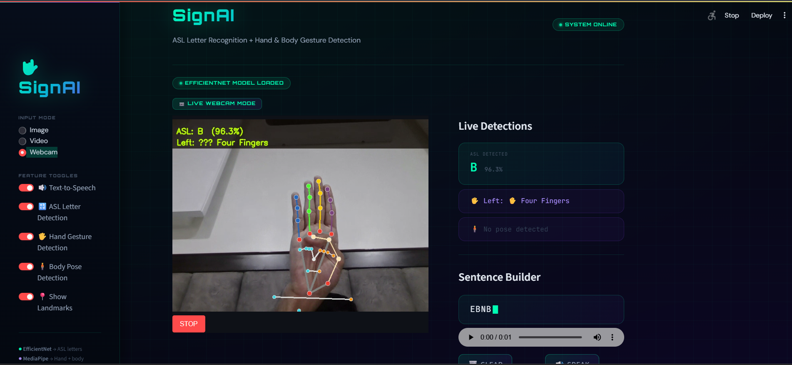

# 🤟 SignAI

An AI-powered **American Sign Language (ASL) Recognition System** built using **EfficientNetB0**, **MediaPipe**, and **Streamlit**. SignAI recognizes ASL alphabet signs from images, videos, and live webcam feeds while also providing hand and body landmark visualization with text-to-speech support.


---

## 📌 Features

- 🔤 ASL Alphabet Recognition (29 Classes)
- 🖼️ Image-based Prediction
- 🎥 Video-based Prediction
- 📷 Real-time Webcam Detection
- ✋ Hand Gesture Detection using MediaPipe
- 🧍 Body Pose Detection
- 📍 Hand & Body Landmark Visualization
- 🔊 Text-to-Speech Output
- 🌙 Modern Cyberpunk Streamlit Interface

---

## 🖥️ Preview

### Home Screen

> Add your application screenshot below.



---

## 🛠️ Tech Stack

- Python
- TensorFlow / Keras
- EfficientNetB0
- OpenCV
- MediaPipe
- Streamlit
- NumPy
- Pillow
- gTTS

---

## 📂 Project Structure

```
SignAI
│
├── app.py
├── requirements.txt
├── README.md
├── .gitignore
│
├── models
│   └── asl_effnet_final.h5
│
├── screenshots
│   └── home.png
│
├── archives
│   └── aap.py
│
└── asl_env (ignored)
```

---

## 🧠 Model

The ASL recognition model is built using **EfficientNetB0** with Transfer Learning.

### Architecture

- EfficientNetB0 (ImageNet Pretrained)
- Global Average Pooling
- Dense (256, ReLU)
- Dropout (0.4)
- Softmax Output Layer (29 Classes)

---

## 📊 Dataset

**ASL Alphabet Dataset**

- 87,000 Images
- 29 Classes
  - A–Z
  - DEL
  - SPACE
  - NOTHING

---

## 📈 Performance

| Metric | Value |
|---------|-------|
| Test Accuracy | **95.36%** |
| Classes | 29 |
| Backbone | EfficientNetB0 |
| Input Size | 160 × 160 |

---

## 🚀 Installation

Clone the repository

```bash
git clone https://github.com/YOUR_USERNAME/SignAI.git

cd SignAI
```

Install dependencies

```bash
pip install -r requirements.txt
```

Run the application

```bash
streamlit run app.py
```

---

## 💡 Future Improvements

- Word-level Sign Recognition
- Sentence Formation
- Dynamic Gesture Recognition
- Transformer-based Video Recognition
- Multi-language Text Translation
- Cloud Deployment

---

## 👨‍💻 Author

**Angad Devgan**

- GitHub: https://github.com/angadevgan
- LinkedIn: https://linkedin.com/in/angad-devgan

---

## ⭐ If you found this project useful, consider giving it a star!